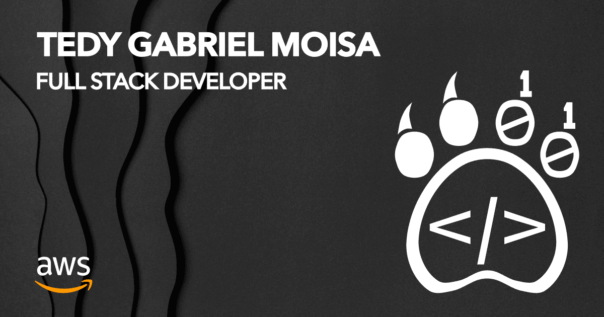

# My Awesome Portfolio

Welcome to the official repository for my personal portfolio website. This project is a modern, interactive, and high-performance static page designed to showcase my skills and projects in a unique and engaging way.

The centerpiece of the site is a digital business card that flips on user interaction, providing a memorable and professional introduction.

### [➡️ View the Live Site Here](https://tedymoisa.com)

---

## ✨ Visual Showcase

### Custom Logo

This is the brand identity used across the portfolio.

### Social Media & Sharing Preview (OG Image)

When the portfolio link is shared on social media platforms, this is the beautiful preview that will be displayed.

---

## 🚀 Key Features

- **Interactive Business Card:** A unique digital business card on the homepage that flips to reveal contact details and professional links.
- **Blazing Fast Performance:** Built with Astro, the site leverages an island architecture to ship zero JavaScript by default, ensuring near-instant load times.
- **Perfect Lighthouse Score:** The website achieves a **perfect score of 100** across all four Lighthouse categories:
  - ✅ **Performance**
  - ✅ **Accessibility**
  - ✅ **Best Practices**
  - ✅ **SEO**
- **Fully SEO Optimized:** Meticulously configured to rank high on search engines and ensure maximum visibility.
- **Type-Safe Codebase:** Developed with TypeScript to ensure the code is robust, maintainable, and free of common errors.
- **Fully Responsive Design:** Provides a seamless and beautiful user experience across all devices, from desktops to mobile phones.

## 🛠 Technology Stack

This project was built using a modern and powerful tech stack:

- **Framework:** [Astro](https://astro.build/)
- **Language:** [TypeScript](https://www.typescriptlang.org/)
- **Styling:** HTML5 & CSS3

## 📄 License

This project is licensed under the MIT License. See the `LICENSE` file for more details.
